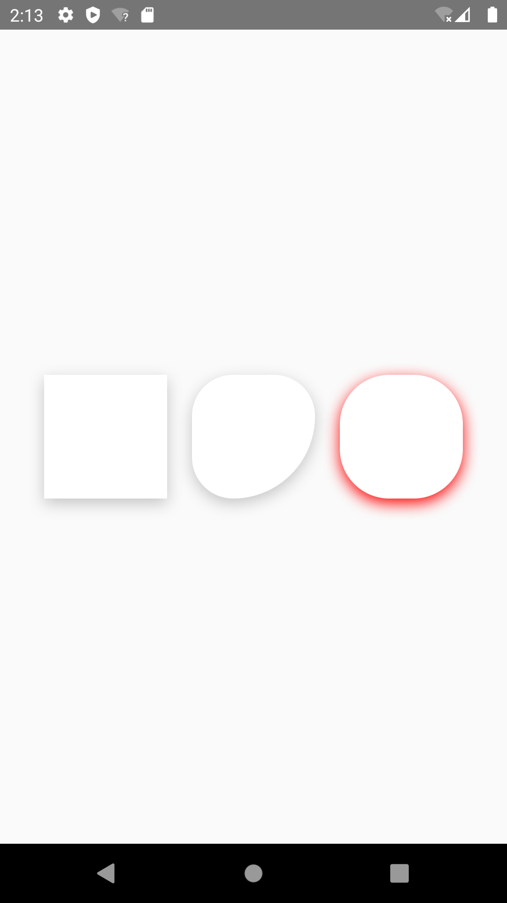

# react-native-shadow-android
Provide a native shadow View component for Android.
## Installation

```sh
npm install react-native-shadow-android
```

## Example!


## Usage

```js
import View from "react-native-shadow-android";

// ...

<View style={{
    shadowColor: 'rgba(142, 142, 142, 0.5)',
    shadowOffset: {
      width: 0,
      height: 4,
    },
    shadowRadius: 8,
    shadowOpacity: 1,
    backgroundColor: '#fff',
    }}
/>
```

## Contributing

See the [contributing guide](CONTRIBUTING.md) to learn how to contribute to the repository and the development workflow.

## License

MIT

---

Made with [create-react-native-library](https://github.com/callstack/react-native-builder-bob)
